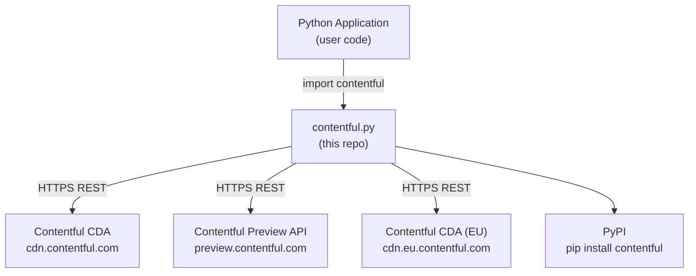

<!-- Generated by seed-golden-context | Last updated: 2026-05-05 -->

# Architecture

## Overview

`contentful.py` is the official Python client library for the Contentful **Content Delivery API (CDA)** and **Content Preview API (CPA)**. It provides read-only access to published and preview content from a Contentful Space, handling HTTP communication, response deserialization, link resolution, localization, synchronization, and rate-limit recovery. It does not support write operations — those belong to `contentful-management.py`.

## System Context



**Who consumes this library:** Any Python application or service that needs to read published Contentful content — websites, data pipelines, scripts, frameworks. It is publicly distributed on PyPI.

**What it wraps:** The [Contentful Content Delivery API](https://www.contentful.com/developers/docs/references/content-delivery-api/) and [Content Preview API](https://www.contentful.com/developers/docs/references/content-preview-api/).

## Internal Structure

| Module | Purpose |
|---|---|
| `contentful/client.py` | Public entry point — `Client` class. Manages HTTP transport, authentication, configuration, and dispatches to `ResourceBuilder`. |
| `contentful/resource_builder.py` | Deserializes raw JSON API responses into typed Python objects. Dispatches to the correct resource class based on `sys.type`. |
| `contentful/entry.py` | `Entry` resource — implements field coercion using the content type cache to hydrate typed fields and resolve links. |
| `contentful/asset.py` | `Asset` resource — image/file metadata with URL helper. |
| `contentful/asset_key.py` | `AssetKey` resource — embargoed asset policy/secret used for signed URL generation. |
| `contentful/space.py` | `Space` resource — space metadata. |
| `contentful/content_type.py` | `ContentType` resource — schema definition for entries. |
| `contentful/content_type_cache.py` | In-process cache of `ContentType` objects keyed by `space_id`, storing a list per space. `get(space_id, content_type_id)` searches that list linearly. Populated on `Client` init; used by `Entry._coerce()` to hydrate fields without extra API calls. |
| `contentful/content_type_field.py` | Models a single field in a content type schema, including its type and coercion logic. |
| `contentful/content_type_field_types.py` | Type coercers — converts raw JSON values to Python types (`date`, `int`, `float`, `RichText`, `Link`, `Array`, etc.). |
| `contentful/locale.py` | `Locale` resource — locale definition. |
| `contentful/sync_page.py` | `SyncPage` resource — wraps the Sync API response, providing pagination tokens and hydrated items. |
| `contentful/array.py` | `Array` resource — paginated list of resources with `total`, `skip`, `limit`, and `.next()` helper. |
| `contentful/taxonomy_concept.py` | `TaxonomyConcept` resource — Contentful taxonomy node (added v2.5.0). |
| `contentful/taxonomy_concept_scheme.py` | `TaxonomyConceptScheme` resource — taxonomy namespace (added v2.5.0). |
| `contentful/deleted_entry.py` | `DeletedEntry` — tombstone object returned by the Sync API. |
| `contentful/deleted_asset.py` | `DeletedAsset` — tombstone object returned by the Sync API. |
| `contentful/resource.py` | Base classes: `Resource` (sys-only), `FieldsResource` (sys + fields with localization), `Link` (unresolved reference placeholder). |
| `contentful/errors.py` | HTTP error hierarchy — `HTTPError`, `RateLimitExceededError`, `EntryNotFoundError`, etc. |
| `contentful/utils.py` | Utilities: `retry_request` (rate-limit backoff), `snake_case`, link/resource detection helpers, logging config. |

### Test Structure

| Directory | Purpose |
|---|---|
| `tests/` | Unit tests using Python `unittest`. One `*_test.py` per module. |
| `fixtures/` | VCR cassettes (YAML) for HTTP replay. Organized by endpoint category (`client/`, `fields/`, `link/`, `cache/`, `integration/`). |

## Data Flow

**Standard request (e.g., `client.entries()`):**

```
Client.entries(query)
  → Client._get(url, query)
    → HTTP GET cdn.contentful.com/.../entries (via requests)
    ← JSON response
  → ResourceBuilder(json, ...).build()
    → Identifies sys.type == "Array"
    → Builds each item: Entry, Asset, etc.
      → Entry._hydrate_fields()
        → ContentTypeCache.get(space_id, content_type_id)
        → ContentTypeField.coerce(value) for each field
        → Link resolution for linked entries/assets (recursive, depth-capped)
    ← List[Entry | Asset | ...]
  ← Array[...]
```

**Sync API flow:**
```
client.sync({'initial': True})
  → SyncPage with items (Entry, Asset, DeletedEntry, DeletedAsset) + nextSyncToken
client.sync({'sync_token': token})
  → Delta of changes since last sync
```

**Link resolution:** When an `Entry` field is a `Link`, `ResourceBuilder` resolves it against the `includes` object returned in the same API response (up to `max_include_resolution_depth`, default 20). Circular references are handled by tracking depth. Unresolvable links return `None`.

**Content type cache:** On `Client.__init__`, `client.content_types()` is called to populate an in-process `ContentTypeCache`. This enables proper field coercion (e.g., knowing a field is `Date` vs `Symbol`) without extra API calls per request. Can be disabled via `content_type_cache=False`.

## Domain Concepts

| Concept | Description |
|---|---|
| **Space** | Top-level container for content — identified by `space_id`. |
| **Environment** | Named branch of a Space's content (e.g., `master`, `staging`). Defaults to `master`. |
| **Entry** | An instance of a Content Type — the main unit of structured content. |
| **Asset** | A media file (image, PDF, etc.) stored in Contentful. |
| **Content Type** | Schema definition — defines the fields of `Entry` objects. |
| **Link** | A reference from one resource to another (resolved during hydration). |
| **Locale** | A language/region variant. Entries can have multiple localized versions of each field. |
| **SyncPage** | A paginated delta from the Sync API — contains full initial dataset or incremental changes. |
| **AssetKey** | A policy + secret pair enabling time-limited signed URLs for embargoed assets. |
| **TaxonomyConcept** | A node in a Contentful taxonomy (e.g., topic classification). Added in v2.5.0. |
| **Deleted{Entry,Asset}** | Tombstone objects from the Sync API indicating a resource was removed. |

## Key Dependencies

| Dependency | Why it's here |
|---|---|
| `requests>=2.31.0,<3.0` | HTTP transport for all CDA/CPA calls. The `tox.ini` matrix tests compatibility back to `requests 1.x` to support users on old environments. |
| `python-dateutil>=2.8.2` | ISO 8601 date/datetime parsing for `Date` and `DateTime` field types. |
| `vcrpy` (test only) | Records and replays HTTP cassettes so tests never hit live APIs. Cassettes are committed under `fixtures/`. |
| `coverage` (test only) | Code coverage reporting. |
| `flake8` (test only) | Linting — configured via `.flake8` (max line length 180, complexity 10). |
| `requests-mock` (test only) | Request mocking for error/edge-case tests. |
| `Sphinx` (docs only) | API docs generation from docstrings; output committed to `docs/`. |
| `pdm` (build) | Dependency management, lockfile, and release tooling. See [ADR: PDM Package Manager](./AI_CONTEXT/ADRs/2025-01-16-pdm-package-manager.md). |

## Configuration

All configuration is passed to `contentful.Client()` at instantiation — there are no environment variables or config files.

| Parameter | Purpose | Default |
|---|---|---|
| `space_id` | Contentful Space ID | required |
| `access_token` | CDA or Preview API token | required |
| `api_url` | CDA host — override for Preview API or EU region | `cdn.contentful.com` |
| `environment` | Contentful environment name | `master` |
| `default_locale` | Locale code for field responses | `en-US` |
| `https` | Use HTTPS vs HTTP | `True` |
| `timeout_s` | HTTP request timeout in seconds | `1` |
| `raw_mode` | Return raw JSON dict instead of typed objects | `False` |
| `gzip_encoded` | Request gzip-compressed responses | `True` |
| `raise_errors` | Raise `HTTPError` on non-2xx responses | `True` |
| `content_type_cache` | Fetch all content types on init for field coercion | `True` |
| `reuse_entries` | Reuse hydrated `Entry`/`Asset` objects across a single request | `False` |
| `max_include_resolution_depth` | Max depth for recursive link resolution | `20` |
| `max_rate_limit_retries` | Retry attempts on `429 Too Many Requests` | `1` |
| `max_rate_limit_wait` | Max wait time (seconds) for rate-limit retry | `60` |
| `proxy_host` / `proxy_port` / `proxy_username` / `proxy_password` | HTTP proxy config | `None` |
| `application_name` / `application_version` | Adds user-agent telemetry header | `None` |
| `integration_name` / `integration_version` | Adds integration user-agent header | `None` |
| `additional_tokens` | Extra access tokens for cross-space link resolution | `None` |

**Preview API:** Pass `api_url='preview.contentful.com'` and a Preview API token.

**EU region:** Pass `api_url='cdn.eu.contentful.com'`.

## Documentation Generation

<!-- Generated by seed-golden-context | Last updated: 2026-05-08 -->

API reference docs are built with [Sphinx](https://www.sphinx-build.org/) and committed as static HTML under `docs/`. The source lives in `_docs/`; `docs/` is always auto-generated — never hand-edit it.

### Source layout

| Path | Purpose |
|---|---|
| `_docs/conf.py` | Sphinx config — theme (`alabaster`), extensions, version injection |
| `_docs/index.rst` | Master document and toctree root |
| `_docs/Makefile` / `make.bat` | Sphinx build drivers |
| `_docs/_static/` | Custom static assets |
| `_docs/contentful.rst` / `_docs/modules.rst` | Auto-generated by `sphinx-apidoc` — deleted and recreated on each build |

### Build pipeline (`pdm run docs`)

1. Delete stale `_docs/contentful.rst` and `_docs/modules.rst`
2. Run `sphinx-apidoc -o _docs/ contentful` — crawls `contentful/` and generates per-module `.rst` stubs from docstrings
3. Run `make -C _docs html` — Sphinx builds HTML into `_docs/_build/html/`
4. Copy built HTML from `_docs/_build/html/` → `docs/` (replaces previous output)
5. Open `docs/index.html` in browser

### Version stamping

`conf.py` dynamically imports `from contentful import __version__` — so the docs always reflect the version in `contentful/__init__.py`. Update `__version__` before running docs for a release.

### Release integration (`pdm run git-docs`)

`git-docs` is a composite script: `docs` → `git add docs` → `git commit --amend -C HEAD`. At release time this amends the last commit on `master` to bake the regenerated HTML in before the version tag is pushed. Reviewers should be aware that `master`'s latest commit is amended by the release process.

### Extensions enabled

- `sphinx.ext.autodoc` — pulls docstrings from `contentful/` source
- `sphinx.ext.viewcode` — adds "view source" links to each documented object
- `sphinx.ext.intersphinx` — cross-references to external Python docs
- `sphinx.ext.githubpages` — adds `.nojekyll` for GitHub Pages compatibility
- `sphinx.ext.coverage` — reports undocumented symbols

## Operational Knowledge

> **Note:** Some operational details have been generalized for this public repository.
> Internal team members: see [internal runbook] for full operational procedures.

### Deployment

`contentful.py` is a published PyPI package. Releases are manual and performed by the DX team.

Release process (requires `pdm` and PyPI credentials from [internal-credentials-vault]):

```bash
# From the repo root
pdm run release
```

This composite command runs: `clean` → `git-docs` (regenerates Sphinx docs and amends the last commit) → `pdm publish` (builds sdist/wheel, uploads to PyPI) → `push-tags` (creates a version tag and pushes).

**Version:** Managed dynamically from `contentful/__init__.py` via `__version__`. Update this before release.

**PyPI auth:** Token-based via `.pypirc`. Credentials are managed by the DX team.

**Known release gotcha:** `pdm run release` can fail with "Requested groups not in lockfile" if the lockfile is stale. Run `pdm lock -d` to regenerate before releasing (refs: PRs #102, #112, #113, #116).

### Failure Modes

| Failure | Symptom | Resolution |
|---|---|---|
| Stale content type cache | Fields coerce incorrectly; wrong types returned | Reinitialize `Client` to refresh cache, or pass `content_type_cache=False` and handle coercion manually |
| Rate limit | `RateLimitExceededError` after `max_rate_limit_retries` exhausted | Increase `max_rate_limit_retries` / `max_rate_limit_wait`; check request frequency |
| 1s timeout | `requests.exceptions.Timeout` on slow connections | Increase `timeout_s` at client init |
| Unresolvable link | Link included in response not in `includes` | Returns `None` — handled by the library; check entry's `errors` array for details |
| Circular references | Deep graphs of linked entries | Capped by `max_include_resolution_depth` (default 20) |
| VCR cassette mismatch (tests) | `CannotSendRequest` during test runs | Cassette was recorded against a different API response; re-record or update the fixture |

## Integration Points

### Upstream (this repo consumes)

- **Contentful CDA** (`cdn.contentful.com`) — read content (entries, assets, content types, spaces, locales) AND embargoed asset key creation (`POST /spaces/{id}/environments/{env}/asset_keys` — the only write operation in this SDK)
- **Contentful Preview API** (`preview.contentful.com`) — read draft/unpublished content
- **Contentful CDA EU** (`cdn.eu.contentful.com`) — EU-region CDA endpoint (configured by user)

### Downstream (consumes this repo)

- Any Python application querying Contentful content — `pip install contentful`
